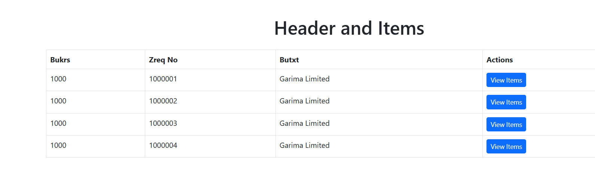

# Bootstrap Node.js Project

This is a simple Node.js project that serves static files and consumes data using Bootstrap for the frontend.



## Project Structure
```
project/
├── public/
│   ├── css/          # Custom CSS files
│   ├── js/           # Custom JS files
│   └── index.html    # Main HTML file
├── node_modules/
├── views/            # EJS templates (optional)
├── app.js            # Main server file
├── package.json
```

## Installation
1. Clone the repository:
   ```sh
   git clone <repository-url>
   ```
2. Navigate to the project directory:
   ```sh
   cd project
   ```
3. Install dependencies:
   ```sh
   npm install
   ```

## Usage
1. Start the server:
   ```sh
   node app.js
   ```
2. Open a browser and navigate to:
   ```
   http://localhost:3000
   ```

## Dependencies
Make sure you have **Node.js** installed. You can check by running:
```sh
node -v
```

## License
This project is licensed under the MIT License.

